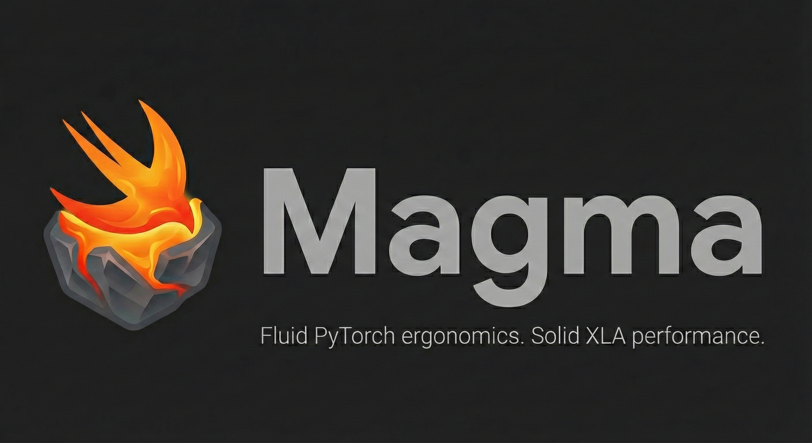

<p align="center">
  
</p>

<h1 align="center">Magma</h1>

<p align="center">
  <strong>Deep learning for Swift, powered by XLA</strong>
</p>

<p align="center">
  <a href="https://swift.org"></a>
  <a href="https://openxla.org"></a>
  <a href="LICENSE"></a>
</p>

---

## The Story of Magma

> **Magma is rock made fluid by intense internal heat.**

* 🪨 **The Rock:** The foundation is **XLA and StableHLO**—rigid, unbreakable, and high-performance.
* 🔥 **The Heat:** **Swift's native differentiation** provides the internal energy. Unlike Python libraries that need an external heat source (a "tape" or tracer) to melt the code, Swift generates gradients intrinsically. This internal heat turns rigid static code into a malleable, trainable medium.
* 🌊 **The Flow:** You shape this molten code with a **PyTorch-compatible API** that feels natural and fluid.
* 💎 **The Result:** When you are ready to execute, the magma cools instantly—compiling back into solid, optimized machine code for your hardware.

---

## Quick Example

A small MLP that learns a **nonlinear** function — value-semantic layers, the
model held as `some Layer`, trained by Swift-native reverse-mode autodiff, with a
generic `Adam` that finds every weight by reflection (no parameter list, no
per-layer update code). This is a real, runnable target:
[`Examples/ValueLayers`](Examples/ValueLayers/main.swift).

```swift
import Magma

// A 1 → 16 → 1 ReLU MLP. `sequential { ... }` composes typed differentiable
// layers; the concrete (nested) type stays hidden behind `some Layer`.
func makeMLP() -> some Layer {
    sequential {
        Linear(weight: Tensor<Float>([Float](repeating: 1, count: 16), shape: [1, 16]),
               bias: Tensor<Float>((0..<16).map { -(Float($0) / 15 * 4 - 2) }, shape: [16]))
        ReLU()
        Linear(weight: Tensor<Float>((0..<16).map { Float($0 % 3) * 0.1 - 0.1 }, shape: [16, 1]),
               bias: Tensor<Float>.zeros([1]))
    }
}

// Dataset: y = x² on [-2, 2].
let xs = stride(from: Float(-2), through: 2, by: 0.5).map { $0 }
let x = Tensor<Float>(xs, shape: [xs.count, 1])
let y = Tensor<Float>(xs.map { $0 * $0 }, shape: [xs.count, 1])

// Mean-squared error, typed over concrete tensors (predictions, targets).
let n = Tensor<Float>.full([], Float(xs.count))
let mse: @differentiable(reverse) (Tensor<Float>, Tensor<Float>) -> Tensor<Float> = { pred, target in
    let r = pred - target
    return (r * r).sum() / n
}

var model = makeMLP()                       // held as `some Layer`
var optimizer = Adam(learningRate: 0.05)

for _ in 0..<2000 {
    // Reverse-mode autodiff through the model, then Adam updates every tensor
    // slot it discovers by reflection — no boilerplate, no manual gradients.
    let grad = modelGradient(of: model, input: x, target: y, lossFn: mse)
    optimizer.update(&model, gradient: grad)
}
```

Running it (`swift run ValueLayersExample`) drives the loss to ~0 and fits the
curve at every point:

```
step    0   loss = 5.4067
step  400   loss = 0.0005
step 2000   loss = 0.0000

  x     target   model
 -2.0     4.00    4.00
 -1.0     1.00    1.00
 +0.0     0.00   -0.00
 +1.0     1.00    1.00
 +2.0     4.00    4.00
```

Notes: `sequential`, `Linear`, `ReLU`, `Conv2d`, `modelGradient`, and the generic
`Adam` are the value-semantic ("Design A") API — the `model` is a plain
`Differentiable` value, so `d(loss)/d(model)` comes straight from the Swift
compiler. `modelGradient` is a thin generic helper that also lets the model stay
opaque as `some Layer` (see [`Documentation/KNOWN_COMPILER_ISSUES.md`](Documentation/KNOWN_COMPILER_ISSUES.md)
for why routing through it matters). The reference-semantic PyTorch-style
`nn.*`/`optim.*` API also exists — see [`Examples/MNIST`](Examples/MNIST/).

## Key Features

- **PyTorch-compatible API**: Familiar `nn.Module`, `nn.Linear`, `optim.Adam`, etc.
- **XLA backend**: Automatic operation fusion, hardware portability (CPU/GPU/TPU)
- **Metal backend**: Native macOS GPU acceleration via [MetalHLO](https://github.com/pedronahum/MetalHLO)
- **Swift-native autodiff**: First-class `@differentiable` support, not a bolted-on tape
- **Lazy execution**: x10-style tracing with explicit barriers for optimal compilation
- **Graph optimization**: DCE, CSE, constant folding, algebraic simplification, operation fusion
- **Pure Swift StableHLO**: IR generation with no C dependencies
- **Distributed training**: data-parallel (DDP) and Shardy/SPMD tensor sharding across multiple devices — see [Distributed & Multi-Device](#distributed--multi-device)

## Architecture

Distributed support is woven through the stack rather than bolted on — each layer
gains a multi-device capability (shown on the second line of each box):

```
┌─────────────────────────────────────────────────────────────────────────┐
│ Magma       PyTorch-style API: nn, optim, Swift-native autodiff         │
│             Distributed: crossReplicaMean, Tensor.sharded, DDP step     │
├─────────────────────────────────────────────────────────────────────────┤
│ LazyTensor  x10 tracing, optimize/cache (DCE, CSE, fusion)              │
│             Graph sharding, collectives, DDP + SPMD runners             │
├─────────────────────────────────────────────────────────────────────────┤
│ StableHLO   Pure-Swift MLIR generation + Shardy (sdy.mesh/sdy.sharding) │
├─────────────────────────────────────────────────────────────────────────┤
│ XLARuntime  PJRT exec (CPU/GPU/TPU), multi-device, scatter/gather       │
│             MetalHLO: macOS GPU via MPSGraph                            │
└─────────────────────────────────────────────────────────────────────────┘
```

## Project Status

🚧 **Active Development** - See [ROADMAP.md](Documentation/ROADMAP.md) for current progress.

### Supported Backends (v0.1.0)

| Backend | Status | Notes |
|---------|--------|-------|
| **CPU** | ✅ Supported | Full functionality via PJRT CPU plugin |
| **TPU** | ✅ Supported | On Google Cloud TPU VMs with `libtpu.so` |
| **Metal** | ✅ Supported | macOS GPU via [MetalHLO](https://github.com/pedronahum/MetalHLO) |
| **GPU (CUDA)** | ✅ Experimental | Single-device execution verified via the CUDA PJRT plugin |

> **Note:** Single-device CUDA GPU execution is working — the CUDA PJRT plugin
> loads, compiles StableHLO, and executes (buffer transfers, elementwise ops, and
> cuBLAS GEMM verified on an NVIDIA GB10). It requires the CUDA PJRT plugin
> (`pjrt_c_api_gpu_plugin.so`, e.g. JAX's `xla_cuda_plugin.so`) on `MAGMA_XLA_PATH`.
> Multi-device **distributed** training (DDP + Shardy/SPMD) is implemented; see the
> section below for what is and isn't tested per backend.

## Distributed & Multi-Device

Magma supports single-host multi-device training in two paradigms, both compiling
to standard PJRT multi-device execution:

- **Data parallel (DDP)** — replicate the model, shard the batch, average gradients
  across replicas. Write it in ordinary Tensor code:

  ```swift
  let synced = grad.crossReplicaMean(groups: [[0, 1]])   // average grads across replicas
  let wNew   = w - synced * lr                           // identical update on every replica

  // ...or the whole step from a differentiable loss, driven by autodiff:
  let updated = try dataParallelSGDStep(
      w: w, lr: 0.1, numReplicas: 2, client: client,
      dataDistribution: [ObjectIdentifier(dataBuf): .perReplica(shards)]
  ) { w in loss(w) }
  ```

- **SPMD / tensor sharding (Shardy)** — annotate tensors with a device mesh + sharding
  and let [OpenXLA Shardy](https://github.com/openxla/shardy) partition the program and
  insert collectives:

  ```swift
  let x = Tensor<Float>.input(from: xBuf).sharded(on: "mesh", ["x", nil])  // row-shard
  let y = x.matmul(w).sharded(on: "mesh", ["x", nil])
  let outs = try executeGraphSharded(y.makeGraph(mesh: mesh), numDevices: 2, client: client)
  ```

Core pieces: `DeviceMesh` / `TensorSharding`, `all_reduce`/`allReduceMean`,
`DistributedSampler` (+ `.multiHost`), and two production runners —
`executeGraphReplicated` (DDP) and `executeGraphSharded` (SPMD). Full design and
status: [MULTI_DEVICE_ASSESSMENT.md](Documentation/MULTI_DEVICE_ASSESSMENT.md).

### Testing status (important)

| Path | CPU (N emulated devices) | GPU (CUDA) |
|------|--------------------------|------------|
| Single-device compile + execute | ✅ | ✅ (NVIDIA GB10) |
| Shardy flags + `sdy` annotations accepted | ✅ | ✅ (single-GPU) |
| **Multi-device** DDP / SPMD / tensor-parallel == single-device reference | ✅ | ⚠️ **untested** |

All distributed logic is developed and verified on **emulated CPU** (the XLA CPU
plugin exposing N virtual devices via `cpuDeviceCount`), each result checked
against a single-device reference. On the CUDA plugin, only *single-GPU* Shardy
compile/execute is verified — **real multi-GPU is untested**: this hardware has one
physical GPU and the CUDA plugin has no multi-device emulation. Validating true
multi-GPU (NCCL collectives, sharded execution) requires a multi-GPU host or TPU
board, where the same runners should exercise the real collectives.

### Metal Backend Benchmarking

🔬 **Performance benchmarking is underway** comparing Magma's Metal backend against [MLX](https://github.com/ml-explore/mlx). The benchmark suite covers core operations (matmul, softmax, GELU, LayerNorm) and transformer patterns (FFN, attention). Results and optimizations will be published as development progresses.

## Heritage

Magma builds on the foundations of:
- [Swift for TensorFlow (S4TF)](https://github.com/tensorflow/swift-apis) - Original lazy tensor design, initializers, loss functions, and layer patterns
- **TaylorTorch** - PyTorch-style API design for Swift
- [SwiftIR](https://github.com/pedronahum/SwiftIR) - MLIR/XLA infrastructure for Swift (the Shardy sharding types were adapted from its `SwiftIRShardingLite`)

Many components are ported from S4TF including:
- Parameter initializers (Glorot, He, LeCun, Orthogonal)
- Loss functions (L1, L2, Hinge, Huber, Cross-entropy, etc.)
- Additional optimizers (RMSProp, AdaGrad, AdaDelta)
- Activation layers (SELU, Mish, Softplus, PReLU)

See [LEGACY_MAPPING.md](Documentation/LEGACY_MAPPING.md) for detailed mapping.

## Requirements

### Swift 6.0+

Magma requires Swift 6.0 or later with autodiff support. Get it from [swift.org](https://swift.org/download/).

### XLA/PJRT Runtime (Required for Execution)

> ⚠️ **Important**: Magma requires the XLA PJRT runtime to execute computations. Without it, you can build and develop but not run models.

Magma uses [OpenXLA's PJRT](https://openxla.org/xla) (Portable JAX Runtime) for hardware acceleration. You need the PJRT plugin library for your target platform:

| Platform | Library | Source |
|----------|---------|--------|
| CPU | `libpjrt_c_api_cpu_plugin.so` | Build from [OpenXLA/XLA](https://github.com/openxla/xla) |
| CUDA GPU | `libpjrt_c_api_gpu_plugin.so` | Build from OpenXLA/XLA |
| TPU | `libtpu.so` | Available on GCP TPU VMs |

**Option 1: Build XLA from source**

> **Tested Versions**:
> - **CPU** — plugin built from XLA commit `9b635916ecc6df6efee62d8e4b0c7ef87ef84d69` (jaxlib 0.10.1, PJRT C-API 0.108); this is the recommended pin and runs the full test suite.
> - **GPU (CUDA)** — verified with JAX's bundled CUDA plugin (`xla_cuda_plugin.so`, CUDA 13 build) on an NVIDIA GB10. Matching the CPU pin's PJRT C-API version is recommended to avoid ABI skew.
>
> The framework was originally validated against XLA commit `bb760b047bdbfeff962f0366ad5cc782c98657e0` (jaxlib 0.9.0); newer pins compatible with the PJRT C-API above also work.

```bash
# Clone XLA and check out the recommended pin (matches the Tested Versions above)
git clone https://github.com/openxla/xla.git
cd xla
git checkout 9b635916ecc6df6efee62d8e4b0c7ef87ef84d69

# Build the PJRT CPU plugin (requires Bazel)
# Linux:
bazel build -c opt //xla/pjrt/c:pjrt_c_api_cpu_plugin.so
# macOS:
bazel build -c opt //xla/pjrt/c:pjrt_c_api_cpu_plugin.dylib

# (optional) CUDA GPU plugin — or just use JAX's bundled xla_cuda_plugin.so
bazel build -c opt //xla/pjrt/c:pjrt_c_api_gpu_plugin.so

# Copy the plugin(s) into your MAGMA_XLA_PATH directory (Linux example)
cp bazel-bin/xla/pjrt/c/pjrt_c_api_cpu_plugin.so /opt/xla/lib/
```

**Option 2: Use prebuilt binaries** (if available)
Check the [releases page](https://github.com/openxla/xla/releases) or use JAX's bundled libraries.

### Environment Variables

Set these before building/running with XLA:

```bash
# Path to directory containing PJRT plugin libraries
export MAGMA_XLA_PATH=/opt/xla/lib

# Enable XLA linking (required for execution)
export MAGMA_ENABLE_XLA=1
```

Optional overrides:

```bash
# Force a specific backend regardless of the requested one (cpu/gpu/tpu/metal),
# when that plugin is available.
export MAGMA_DEFAULT_BACKEND=gpu

# Override the safety guard that refuses a second concurrent accelerator
# (GPU/TPU) client. Each accelerator client reserves most of device memory, so
# on a unified-memory machine a second client can exhaust memory and freeze the
# box; the guard prevents that. Set to 1 only if you know the machine has room.
export MAGMA_ALLOW_CONCURRENT_ACCEL_CLIENTS=1
```

## Quick Start

### Development Mode (No XLA)

You can build and test the pure Swift components without XLA:

```bash
# Clone
git clone https://github.com/pedronahum/Magma.git
cd Magma

# Build (stub mode - no execution)
swift build

# Run pure Swift tests (StableHLO, shape inference, etc.)
swift test --filter StableHLOTests
swift test --filter LazyTensorTests
```

### Full Mode (With XLA)

To run actual computations, you need XLA installed:

```bash
# Set environment
export MAGMA_XLA_PATH=/opt/xla/lib
export MAGMA_ENABLE_XLA=1

# Build with XLA
swift build

# Run all tests. Prefer a CPU PJRT plugin ($MAGMA_XLA_PATH/pjrt_c_api_cpu_plugin.so):
# it runs the whole suite in seconds with no accelerator memory reserved. Keep
# --no-parallel — the GPU smoke suites each spin up a PJRT client, and on a
# unified-memory box (e.g. NVIDIA GB10) each CUDA client reserves ~75-80% of
# memory, so a parallel run can OOM-freeze the machine. Note: one process can
# only load one plugin, so run the GPU-only suites in a separate invocation.
swift test --no-parallel --filter MagmaTests   # CoreTests, runs on CPU

# Run MNIST example
swift run MNISTExample
```

### TPU Deployment

See [TPU_DEPLOYMENT.md](Documentation/TPU_DEPLOYMENT.md) for running on Google Cloud TPUs.

## Documentation

- [Architecture Overview](Documentation/ARCHITECTURE.md)
- [Roadmap & Phases](Documentation/ROADMAP.md)
- [API Reference](Documentation/API.md)
- [Distributed & Multi-Device](Documentation/MULTI_DEVICE_ASSESSMENT.md)
- [Contributing](CONTRIBUTING.md)

## License

Apache 2.0 - See [LICENSE](LICENSE)
