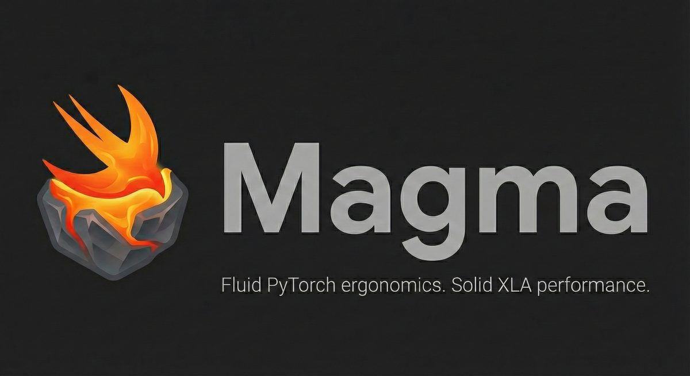

<p align="center">
  
</p>

<h1 align="center">Magma</h1>

<p align="center">
  <strong>Deep learning for Swift, powered by XLA</strong>
</p>

<p align="center">
  <a href="https://swift.org"></a>
  <a href="https://openxla.org"></a>
  <a href="LICENSE"></a>
</p>

> **Alpha status (`0.1.0-alpha.1`).** Magma is an early pre-release. The API will
> change, only the CPU backend is routinely tested, and CUDA, Metal, TPU and
> multi-device execution are experimental or untested. See the
> [known limitations](CHANGELOG.md#known-limitations) before relying on it.

---

## The Story of Magma

> **Magma is rock made fluid by intense internal heat.**

* 🪨 **The Rock:** The foundation is **XLA and StableHLO**—rigid, unbreakable, and high-performance.
* 🔥 **The Heat:** **Swift's native differentiation** provides the internal energy. Unlike Python libraries that need an external heat source (a "tape" or tracer) to melt the code, Swift generates gradients intrinsically. This internal heat turns rigid static code into a malleable, trainable medium.
* 🌊 **The Flow:** You shape this molten code with **value-semantic layers and a PyTorch-style API** that feel natural and fluid.
* 💎 **The Result:** When you are ready to execute, the magma cools instantly—compiling back into solid, optimized machine code for your hardware.

---

## Quick Example

A small MLP that learns a **nonlinear** function — value-semantic layers, the
model held as `some Layer`, trained by Swift-native reverse-mode autodiff, with a
generic `Adam` that finds every weight by reflection (no parameter list, no
per-layer update code). This is a real, runnable target:
[`Examples/ValueLayers`](Examples/ValueLayers/main.swift).

```swift
import Magma

// A 1 → 16 → 1 ReLU MLP. `sequential { ... }` composes typed differentiable
// layers; the concrete (nested) type stays hidden behind `some Layer`.
func makeMLP() -> some Layer {
    sequential {
        Linear(weight: Tensor<Float>([Float](repeating: 1, count: 16), shape: [1, 16]),
               bias: Tensor<Float>((0..<16).map { -(Float($0) / 15 * 4 - 2) }, shape: [16]))
        ReLU()
        Linear(weight: Tensor<Float>((0..<16).map { Float($0 % 3) * 0.1 - 0.1 }, shape: [16, 1]),
               bias: Tensor<Float>.zeros([1]))
    }
}

// Dataset: y = x² on [-2, 2].
let xs = stride(from: Float(-2), through: 2, by: 0.5).map { $0 }
let x = Tensor<Float>(xs, shape: [xs.count, 1])
let y = Tensor<Float>(xs.map { $0 * $0 }, shape: [xs.count, 1])

// Mean-squared error, typed over concrete tensors (predictions, targets).
let n = Tensor<Float>.full([], Float(xs.count))
let mse: @differentiable(reverse) (Tensor<Float>, Tensor<Float>) -> Tensor<Float> = { pred, target in
    let r = pred - target
    return (r * r).sum() / n
}

var model = makeMLP()                       // held as `some Layer`
var optimizer = Adam(learningRate: 0.05)

for _ in 0..<2000 {
    // Reverse-mode autodiff through the model, then Adam updates every tensor
    // slot it discovers by reflection — no boilerplate, no manual gradients.
    let grad = modelGradient(of: model, input: x, target: y, lossFn: mse)
    optimizer.update(&model, gradient: grad)
}
```

Running it (`MAGMA_XLA_PATH=/opt/xla/lib swift run ValueLayersExample`, about
20 s on a CPU plugin) drives the loss to ~0 and fits the curve at every point
(output abridged):

```
step    0   loss = 5.4067
step  400   loss = 0.0005
step 2000   loss = 0.0000

  x     target   model
 -2.0     4.00    4.00
 -1.0     1.00    1.00
 +0.0     0.00   -0.00
 +1.0     1.00    1.00
 +2.0     4.00    4.00
```

**Two layer APIs.** The example above uses the **value-semantic** API —
`sequential`, `Linear`, `ReLU`, `Conv2d`, the generic `Adam`, and `modelGradient`.
The model is a plain `Differentiable` value, so `d(loss)/d(model)` comes straight
from the Swift compiler and one generic optimizer trains any model by reflection —
no parameter list, no per-layer update code. (`modelGradient` is a thin generic
helper that also lets the model stay opaque as `some Layer`; see
[`Documentation/KNOWN_COMPILER_ISSUES.md`](Documentation/KNOWN_COMPILER_ISSUES.md)
for why routing through it matters.) This surface is newer and still evolving, but
it is exercised end to end by the test suite. Its `Linear` computes `x · W + b`
with `weight` shaped `[in, out]`.

A second, **reference-semantic** API mirrors PyTorch's `Module`/`Parameter` shape —
`nn.Linear`, `nn.Conv2d`, … and `optim.SGD`/`optim.Adam` — for building and running
networks. An `nn.Module` is not itself `Differentiable`, so you don't differentiate
the model value directly; instead `parameterGradients(of:loss:)` differentiates a
loss over a layer's parameters and hands back an identity-keyed gradient map that
`optimizer.step(_:)` applies **by parameter identity, not array position**. That
makes the manual path safe and real — an `nn.Linear` trains to convergence with
true autodiff gradients in the test suite (`NNTrainingBridgeTests`). For *ergonomic
whole-model* autodiff — differentiate the entire model with no parameter
bookkeeping — reach for the value-semantic API above.

```swift
// The reference-semantic nn.* path, trained with real gradients via the bridge.
// (x: [batch, 2], y: [batch, 1])
let fc = nn.Linear(inputSize: 2, outputSize: 1)          // parameters: [weight, bias]
var opt = optim.Adam(parameters: fc.parameters(), lr: 0.2)

let (loss, grads) = parameterGradients(of: fc.parameters()) { p in
    let pred = x.matmul(p[0].transpose()) + p[1].broadcast(to: [batch, 1])
    return ((pred - y) * (pred - y)).sum() / n           // p[0] = weight, p[1] = bias
}
opt.step(grads)      // gradients matched to parameters by identity, not by position
```

> ⚠️ **Naming:** unqualified `Linear`, `ReLU`, `Sigmoid`, `Conv2d`, `Adam`, and
> `sequential` resolve to the **value-semantic** types; the reference-semantic ones
> live under `nn.`/`optim.` (`nn.Linear`, `optim.Adam`). They take different
> initializers and follow different conventions — value-semantic `Linear.weight`
> is `[in, out]`, `nn.Linear.weight` is `[out, in]` (PyTorch layout); `Adam` is
> driven by `update(&model, gradient:)`, `optim.Adam` by `step(_:)`. Don't paste
> an `nn.*` snippet and then write the names unqualified.

### Execution model — lazy tracing, explicit barriers

Magma traces tensor operations into a graph and runs nothing until a **barrier**.
Reading values (`.scalars()`, `.item()`) or calling `.materialize()` marks that
tensor and runs a barrier for it. A barrier executes only the tensors that were
**marked** with `markForMaterialization()` (plus what they depend on) — creating
a tensor does not mark it, so a bare `LazyTensorBarrier()` with nothing marked
does nothing. To compute several tensors in one compiled program without reading
them yet:

```swift
let y = x.matmul(w).relu()   // lazy — nothing has executed yet
let z = y.sum()
y.markForMaterialization()
z.markForMaterialization()
LazyTensorBarrier()          // compile + execute y and z together
print(y.scalars())           // already computed: just a device-to-host copy
```

The training loop above needs no explicit barrier: the generic `Adam` materializes
the updated weights each step, so the traced graph stays flat across iterations
instead of growing unboundedly. In hand-written loops, mark the state you carry
across iterations and call `LazyTensorBarrier()` once per iteration (or call
`.materialize()` on it) to get the same effect — see
[`Examples/BuildingSimulation`](Examples/BuildingSimulation/main.swift).

**Errors.** If a tensor cannot be computed — no PJRT plugin, a program the
backend rejects — `scalars()`, `item()` and `materialize()` stop the program with
the underlying `MaterializationError` (they used to return `[]`). Use the
throwing variants to handle it yourself:

```swift
do {
    let probs = try logits.softmax(dim: -1).fetchScalars()   // or fetchItem()
} catch let error as MaterializationError {
    print("failed at stage \(error.stage): \(error)")        // e.g. .backendUnavailable
}
```

`LazyTensorBarrierThrowing(on:)` is the throwing barrier. On a compile failure,
set `MAGMA_DEBUG=1` (or `MAGMA_DEBUG_DIR=<dir>`) to dump the failing MLIR.
Reading tensors from several threads is safe; barriers are serialized
process-wide.

**Reproducibility.** `manualSeed(42)` makes every host-side random draw
deterministic (`randn`/`uniform`, weight initializers, dropout masks, data
shuffles, random transforms); `withManualSeed(42) { ... }` gives one task its own
seeded stream. Device-side RNG ops (`randnDevice`, `useDeviceRNG: true`) are not
covered.

## Key Features

- **Swift-native autodiff**: models are plain `Differentiable` values — gradients come from the compiler, not a bolted-on tape or tracer.
- **Value-semantic layers**: `sequential { Linear; ReLU; ... }` composes typed differentiable layers, trained by one generic reflection-based optimizer — no parameter lists, no per-layer update code.
- **PyTorch-style layer library**: a familiar `nn.*` / `optim.*` set (`nn.Linear`, `nn.Conv2d`, `optim.Adam`, …) for building, running, and training networks (reference-semantic, `Parameter`-based); trained via the `parameterGradients` autodiff bridge with identity-keyed optimizer steps.
- **XLA backend**: x10-style lazy tracing compiled to StableHLO and executed via PJRT (CPU; CUDA GPU experimental; TPU untested). Kernel fusion is left to XLA's compiler.
- **Metal backend** (experimental, opt-in): macOS GPU acceleration via [MetalHLO](https://github.com/pedronahum/MetalHLO).
- **Graph optimization**: DCE, CSE, constant folding, and algebraic simplification before compilation, plus bounded (LRU) compilation caches (`Sources/LazyTensor/Optimization`).
- **Pure-Swift StableHLO**: MLIR/StableHLO text generation with no C dependencies.
- **Distributed training**: data-parallel (DDP) and Shardy/SPMD tensor sharding across multiple devices — see [Distributed & Multi-Device](#distributed--multi-device).

## Architecture

Distributed support is woven through the stack rather than bolted on — each layer
gains a multi-device capability (shown on the second line of each box):

```
┌─────────────────────────────────────────────────────────────────────────┐
│ Magma       PyTorch-style API: nn, optim, Swift-native autodiff         │
│             Distributed: crossReplicaMean, Tensor.sharded, DDP step     │
├─────────────────────────────────────────────────────────────────────────┤
│ LazyTensor  x10 tracing, optimize/cache (DCE, CSE, folding, simplify)   │
│             Graph sharding, collectives, DDP + SPMD runners             │
├─────────────────────────────────────────────────────────────────────────┤
│ StableHLO   Pure-Swift MLIR generation + Shardy (sdy.mesh/sdy.sharding) │
├─────────────────────────────────────────────────────────────────────────┤
│ XLARuntime  PJRT exec (CPU/GPU/TPU), multi-device, scatter/gather       │
│             MetalHLO: macOS GPU via MPSGraph                            │
└─────────────────────────────────────────────────────────────────────────┘
```

## Project Status

🚧 **Alpha** (`0.1.0-alpha.1`) — see the [CHANGELOG](CHANGELOG.md) for what is in
this release and its known limitations, and [ROADMAP.md](Documentation/ROADMAP.md)
for what comes next.

### Supported Backends (0.1.0-alpha.1)

| Backend | Status | Notes |
|---------|--------|-------|
| **CPU** | ✅ Supported | PJRT CPU plugin; the full test suite runs on it |
| **GPU (CUDA)** | ⚠️ Experimental | Single-device execution verified on an NVIDIA GB10 |
| **Metal** | ⚠️ Experimental, opt-in | macOS GPU via [MetalHLO](https://github.com/pedronahum/MetalHLO); build with `MAGMA_ENABLE_METAL=1` |
| **TPU** | ❓ Untested | Code path for `libtpu` exists but has not been run by the maintainers — see [TPU_DEPLOYMENT.md](Documentation/TPU_DEPLOYMENT.md) |

> **Note:** Single-device CUDA GPU execution works — the CUDA PJRT plugin
> loads, compiles StableHLO, and executes (buffer transfers, elementwise ops, and
> cuBLAS GEMM verified on an NVIDIA GB10). It requires a CUDA PJRT plugin
> (`pjrt_c_api_gpu_plugin.so`, or JAX's `xla_cuda_plugin.so`) in `MAGMA_XLA_PATH`.
> Multi-device **distributed** training (DDP + Shardy/SPMD) is implemented; see the
> section below for what is and isn't tested per backend.

## Distributed & Multi-Device

Magma supports single-host multi-device training in two paradigms, both compiling
to standard PJRT multi-device execution:

- **Data parallel (DDP)** — replicate the model, shard the batch, average gradients
  across replicas. Write it in ordinary Tensor code:

  ```swift
  let synced = grad.crossReplicaMean(groups: [[0, 1]])   // average grads across replicas
  let wNew   = w - synced * lr                           // identical update on every replica

  // ...or the whole step from a differentiable loss, driven by autodiff:
  let updated = try dataParallelSGDStep(
      w: w, lr: 0.1, numReplicas: 2, client: client,
      dataDistribution: [ObjectIdentifier(dataBuf): .perReplica(shards)]
  ) { w in loss(w) }
  ```

- **SPMD / tensor sharding (Shardy)** — annotate tensors with a device mesh + sharding
  and let [OpenXLA Shardy](https://github.com/openxla/shardy) partition the program and
  insert collectives:

  ```swift
  let x = Tensor<Float>.input(from: xBuf).sharded(on: "mesh", ["x", nil])  // row-shard
  let y = x.matmul(w).sharded(on: "mesh", ["x", nil])
  let outs = try executeGraphSharded(y.makeGraph(mesh: mesh), numDevices: 2, client: client)
  ```

Core pieces: `DeviceMesh` / `TensorSharding`, `crossReplicaSum` / `crossReplicaMean`
(lowered to `all_reduce`), `DistributedSampler` (+ `.multiHost`), and two runners —
`executeGraphReplicated` (DDP) and `executeGraphSharded` (SPMD); both currently
handle `Float32` only. Full design and status:
[MULTI_DEVICE_ASSESSMENT.md](Documentation/MULTI_DEVICE_ASSESSMENT.md).

### Testing status (important)

| Path | CPU (N emulated devices) | GPU (CUDA) |
|------|--------------------------|------------|
| Single-device compile + execute | ✅ | ✅ (NVIDIA GB10) |
| Shardy flags + `sdy` annotations accepted | ✅ | ✅ (single-GPU) |
| **Multi-device** DDP / SPMD / tensor-parallel == single-device reference | ✅ | ⚠️ **untested** |

All distributed logic is developed and verified on **emulated CPU** (the XLA CPU
plugin exposing N virtual devices via `cpuDeviceCount`), each result checked
against a single-device reference. On the CUDA plugin, only *single-GPU* Shardy
compile/execute is verified — **real multi-GPU is untested**: this hardware has one
physical GPU and the CUDA plugin has no multi-device emulation. Validating true
multi-GPU (NCCL collectives, sharded execution) requires a multi-GPU host or TPU
board, where the same runners should exercise the real collectives.

### Metal Backend Benchmarking

🔬 **Performance benchmarking is underway** comparing Magma's Metal backend against [MLX](https://github.com/ml-explore/mlx). The experimental benchmark packages (macOS on Apple Silicon only) live in [`Benchmarks/`](Benchmarks/README.md); no results are published yet.

## Heritage

Magma builds on the foundations of:
- [Swift for TensorFlow (S4TF)](https://github.com/tensorflow/swift-apis) - Original lazy tensor design, initializers, loss functions, and layer patterns
- **TaylorTorch** - PyTorch-style API design for Swift
- [SwiftIR](https://github.com/pedronahum/SwiftIR) - MLIR/XLA infrastructure for Swift (the Shardy sharding types were adapted from its `SwiftIRShardingLite`)

Many components are ported from S4TF including:
- Parameter initializers (Glorot, He, LeCun, Orthogonal)
- Loss functions (L1, L2, Hinge, Huber, Cross-entropy, etc.)
- Additional optimizers (RMSProp, AdaGrad, AdaDelta)
- Activation layers (SELU, Mish, Softplus, PReLU)

See [LEGACY_MAPPING.md](Documentation/LEGACY_MAPPING.md) for detailed mapping.

## Requirements

### Swift 6.0+ (swift.org toolchain)

Magma requires Swift 6.0 or later **from [swift.org](https://swift.org/download/)**
(the full test suite is verified on 6.0.3 and 6.3.3). Xcode's bundled toolchain
does not ship the `_Differentiation` module, so it cannot build Magma; on macOS
install a swift.org toolchain (e.g. with `swiftly`).

| Platform | Status |
|----------|--------|
| Linux x86_64 / aarch64 | Supported (verified on aarch64, NVIDIA GB10; CI on Swift 6.0 and 6.3) |
| macOS 15+ | Builds; CI job is experimental |

### Installation (SwiftPM)

```swift
// Package.swift
dependencies: [
    .package(url: "https://github.com/pedronahum/Magma.git", exact: "0.1.0-alpha.1"),
],
targets: [
    .target(name: "MyApp", dependencies: [
        .product(name: "Magma", package: "Magma"),
    ]),
]
```

`import Magma` is all you need: it re-exports the lower layers (`Device`,
`Backend`, `DType`, `LazyTensorBarrier`, `MaterializationError`, ...) and the
`_Differentiation` module (`@differentiable`, `gradient(at:)`).

### XLA/PJRT Runtime (Required for Execution)

> ⚠️ **Important**: Magma builds without any XLA libraries — no build flags are
> needed — but it needs a PJRT plugin at **runtime** to execute computations. The
> plugin is loaded with `dlopen` when a backend is first used. Without one you can
> build and run the plugin-free tests, but reading a computed tensor stops with a
> `backendUnavailable` error that lists every path searched.

Magma uses [OpenXLA's PJRT](https://openxla.org/xla) plugin interface. You need
the plugin library for your target platform (`.dylib` instead of `.so` on macOS):

| Platform | File names searched | Source |
|----------|---------------------|--------|
| CPU | `pjrt_c_api_cpu_plugin.so` or `libpjrt_c_api_cpu_plugin.so` | Build from [OpenXLA/XLA](https://github.com/openxla/xla) |
| CUDA GPU | `pjrt_c_api_gpu_plugin.so`, `libpjrt_c_api_gpu_plugin.so`, or `xla_cuda_plugin.so` | Build from OpenXLA/XLA, or JAX's CUDA plugin wheel |
| TPU | `pjrt_c_api_tpu_plugin.so`, `libpjrt_c_api_tpu_plugin.so`, or `libtpu.so` | Available on Google Cloud TPU VMs (untested) |

**Plugin search order** (per backend; the first existing file wins):

1. `MAGMA_PJRT_PLUGIN_CPU` / `MAGMA_PJRT_PLUGIN_GPU` / `MAGMA_PJRT_PLUGIN_TPU` — the
   full path of that backend's plugin. When set, it is the only candidate.
2. `$MAGMA_XLA_PATH/<name>` for each file name in the table above.
3. TPU only: `$TPU_LIBRARY_PATH` (a file path), then `/usr/lib/libtpu.so`,
   `/usr/local/lib/libtpu.so`, `/lib/libtpu.so`.
4. System directories: `/opt/xla/lib`, `/usr/local/lib`, `/opt/magma/lib` on Linux
   (`/usr/local/lib`, `/opt/xla/lib` on macOS).

`Backend.cpu.resolvedPluginPath` (etc.) reports which file would be loaded. One
process can load only one PJRT plugin.

**Option 1: Build XLA from source**

> **Tested Versions**:
> - **CPU** — plugin built from XLA commit `9b635916ecc6df6efee62d8e4b0c7ef87ef84d69` (jaxlib 0.10.1, PJRT C-API 0.108); this is the recommended pin and runs the full test suite.
> - **GPU (CUDA)** — verified with JAX's bundled CUDA plugin (`xla_cuda_plugin.so`, CUDA 13 build) on an NVIDIA GB10. Matching the CPU pin's PJRT C-API version is recommended to avoid ABI skew.
>
> The framework was originally validated against XLA commit `bb760b047bdbfeff962f0366ad5cc782c98657e0` (jaxlib 0.9.0); newer pins compatible with the PJRT C-API above may also work.

```bash
# Clone XLA and check out the recommended pin (matches the Tested Versions above)
git clone https://github.com/openxla/xla.git
cd xla
git checkout 9b635916ecc6df6efee62d8e4b0c7ef87ef84d69

# Build the PJRT CPU plugin (requires Bazel)
# Linux:
bazel build -c opt //xla/pjrt/c:pjrt_c_api_cpu_plugin.so
# macOS:
bazel build -c opt //xla/pjrt/c:pjrt_c_api_cpu_plugin.dylib

# (optional) CUDA GPU plugin — or just use JAX's bundled xla_cuda_plugin.so
bazel build -c opt //xla/pjrt/c:pjrt_c_api_gpu_plugin.so

# Copy the plugin(s) into your MAGMA_XLA_PATH directory (Linux example)
cp bazel-bin/xla/pjrt/c/pjrt_c_api_cpu_plugin.so /opt/xla/lib/
```

**Option 2: Use prebuilt binaries** (if available)
Check the [releases page](https://github.com/openxla/xla/releases) or use JAX's bundled libraries.

### Environment Variables

All of these are read at **runtime**; none is needed to build.

```bash
# Directory containing the PJRT plugin(s). This is the one you need to *run* models.
export MAGMA_XLA_PATH=/opt/xla/lib

# Pin one backend's plugin to an exact file (overrides the search above).
export MAGMA_PJRT_PLUGIN_GPU=/path/to/xla_cuda_plugin.so   # also _CPU, _TPU
```

Optional:

```bash
# Execute on this backend (cpu/gpu/tpu/metal) regardless of the requested device,
# when its plugin is available. (If the requested backend's plugin is missing,
# Magma already falls back to the best available one.)
export MAGMA_DEFAULT_BACKEND=gpu

# Override the safety guard that refuses a second concurrent accelerator
# (GPU/TPU) client. Each accelerator client reserves most of device memory, so
# on a unified-memory machine a second client can exhaust memory and freeze the
# box; the guard prevents that. Set to 1 only if you know the machine has room.
export MAGMA_ALLOW_CONCURRENT_ACCEL_CLIENTS=1

# On a compile failure, write the failing MLIR to the system temp dir
# (MAGMA_DEBUG=1) or to a directory of your choice.
export MAGMA_DEBUG=1
export MAGMA_DEBUG_DIR=/tmp/magma-mlir

# Where MNIST is cached (as $MAGMA_DATA_DIR/mnist; default ~/.magma/data/mnist).
export MAGMA_DATA_DIR=$HOME/datasets

# Tests only: which backend's suites run (cpu, the default, or gpu).
export MAGMA_TEST_BACKEND=gpu
```

Build-time switches (macOS only) for the opt-in Metal backend:

```bash
# Add the MetalHLO dependency (fetched from GitHub's main branch) and the
# MetalExample target.
export MAGMA_ENABLE_METAL=1
# Optional: build against a local MetalHLO checkout instead.
export MAGMA_METALHLO_PATH=/path/to/MetalHLO
```

## Quick Start

```bash
# Clone and build — no flags, no XLA needed at build time
git clone https://github.com/pedronahum/Magma.git
cd Magma
swift build

# Run the tests. Without a plugin, suites that execute on a backend are
# reported as skipped and the rest (StableHLO, graph passes, ...) run.
swift test
```

### With a PJRT plugin

```bash
export MAGMA_XLA_PATH=/opt/xla/lib     # contains pjrt_c_api_cpu_plugin.so

# Full suite on the CPU plugin (~1150 tests). Keep --no-parallel when a plugin is
# present: suites share process-wide state, and on a unified-memory box (e.g.
# NVIDIA GB10) each CUDA client reserves ~75-80% of memory, so a parallel run can
# OOM-freeze the machine.
swift test --no-parallel

# GPU suites: a separate invocation, because one process can load only one plugin.
MAGMA_TEST_BACKEND=gpu swift test --no-parallel --filter 'GPU|OutputDType|PluginMismatch'

# Run the value-semantic training example (the Quick Example above)
swift run ValueLayersExample
```

See [CONTRIBUTING.md](CONTRIBUTING.md) for the full testing guide.

### Examples

Examples are executable targets in this package (not exported as products); run
them from a clone with `swift run <Target>`. All but `MetalExample` need a PJRT
plugin in `MAGMA_XLA_PATH` and exit with an error message if none is found.

| Target | What it shows | Platform | Network |
|--------|---------------|----------|---------|
| `ValueLayersExample` | Value-semantic MLP (`sequential`, `modelGradient`, generic `Adam`) fitting y = x² — the Quick Example | Linux, macOS | No |
| `MNISTExample [batches]` | Smoke test on real MNIST: a 784→64→10 MLP with Swift autodiff and plain SGD over a few hundred batches, then test accuracy | Linux, macOS | First run downloads ~11 MB (needs `gzip`); cached in `~/.magma/data/mnist` |
| `BuildingSimulation [mode] [trials] [timesteps]` | Differentiable building-thermal simulation: native Swift vs. Magma unrolled, per-step barrier and `scan` variants (`native` mode needs no plugin) | Linux, macOS | No |
| `Benchmarks [--iterations N] [--warmup N] [--mixed-precision]` | Timing of matmul (other suites opt-in in source) | Linux, macOS | No |
| `MetalExample [--diagnostics \| --sweep]` | Tensor ops and matmul on the Metal backend | macOS on Apple Silicon, only with `MAGMA_ENABLE_METAL=1` | Package resolution fetches MetalHLO |

The separate Metal benchmark packages are described in
[`Benchmarks/README.md`](Benchmarks/README.md).

### TPU Deployment

TPU execution has not been verified for this alpha. See
[TPU_DEPLOYMENT.md](Documentation/TPU_DEPLOYMENT.md) for setup notes if you want
to try it.

## Documentation

- [Architecture Overview](Documentation/ARCHITECTURE.md)
- [Roadmap & Phases](Documentation/ROADMAP.md)
- [API Reference](Documentation/API.md)
- [Distributed & Multi-Device](Documentation/MULTI_DEVICE_ASSESSMENT.md)
- [TPU Deployment (untested)](Documentation/TPU_DEPLOYMENT.md)
- [Known Compiler Issues](Documentation/KNOWN_COMPILER_ISSUES.md)
- [Changelog](CHANGELOG.md)
- [Contributing](CONTRIBUTING.md) · [Code of Conduct](CODE_OF_CONDUCT.md) · [Security Policy](SECURITY.md)

## License

Apache 2.0 - See [LICENSE](LICENSE) and [NOTICE](NOTICE)
